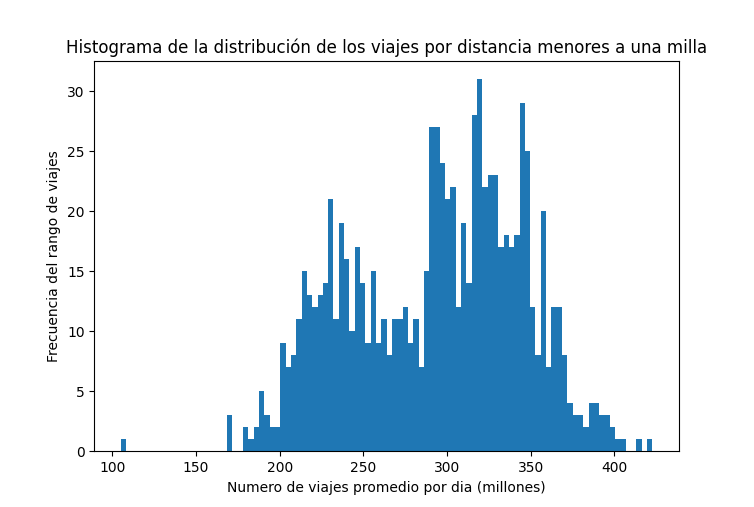
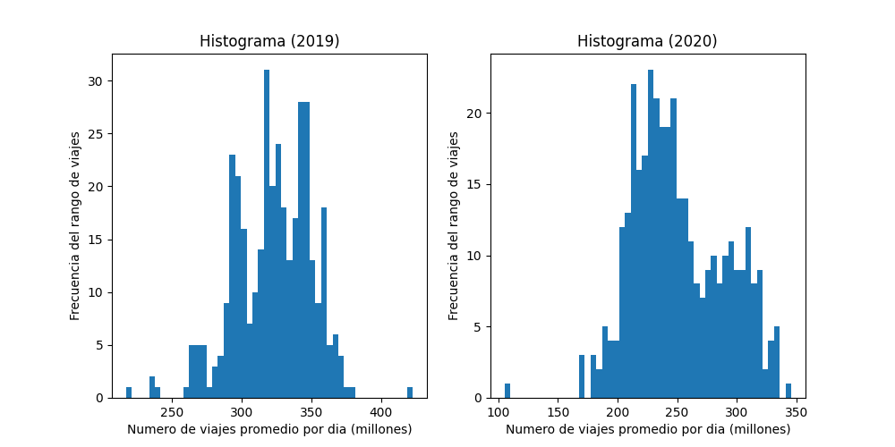
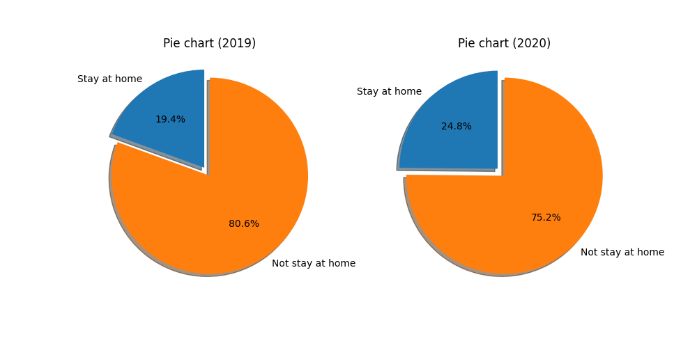
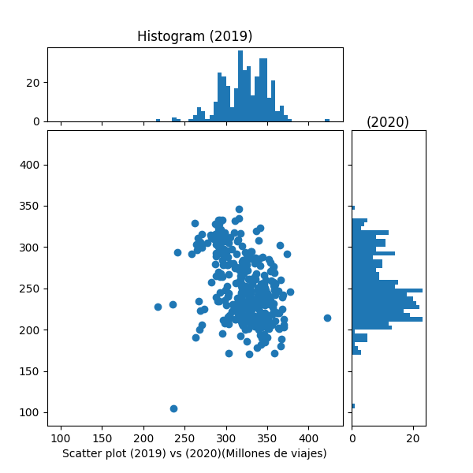

# El Bureau of Transportation Statistics


## Data de referencia
Se utilizó como referencia información obtenida de una API realizada por BTS (Bureau of Transportation Statistics). La información de esta API se puede encontrar en el siguien link: [link to API](https://data.bts.gov/resource/w96p-f2qv)
<br>
Este csv contiene información de los viajes realizados por los estadounidenses en los años 2019, 2020 y 2021. Así tambien como información de las personas que decidieron quedarse en casa y las que decidieron salir de casa. Todo esto viene en forma de promedio diario y dividido por semana y mes. Además los viajes se encuentran divididos por distancia, siendo estos menores a una milla, entre una y tres millas, entre tres y cinco millas, hasta llegar a los viajes mayores a 500 millas.
<br>
Finalmente para la graficación de la información se utilizó la libreria de matplotlib. Para esto se observó la guia de uso en el siguiente link: [link to matplotlib](https://matplotlib.org/stable/index.html)

## Distribución de los viajes realizados por los pasajeros en los Estados Unidos menores a una milla

El primer analisis realizado de la data obtenida fue observar la forma de la data mediante un histograma, para esto se utilizo el siguiente codigo usando la libreria de matplotlib:

```python
def plot_normal_distribution(df_serie):
    # Creacion del histograma, seteo de titulo y etiquetas
    plt.hist(df_serie/1000000, bins=100)
    plt.title("Histograma de la distribución de los viajes por distancia menores a una milla") # noqa
    plt.xlabel("Numero de viajes promedio por dia (millones)")
    plt.ylabel("Frecuencia del rango de viajes")
    plt.show()

```
La figura se puede observar a continuación:



Del analisis de la presentr figura se puede observar que hay dos poblaciones diferentes siendo analizadas, esto por el hecho que se ven dos medias presentes, a la hora de ver la data en profundidad se observa que los datos analizados son de los años 2019, 2020 y parte del 2021. Justo cuando el COVID-19 estaba teniendo efecto. Para poder ver una distribución más agradable y representativa se recomienda la separación de esta información por año.
<br>
Se decidió realizar un analisis de la data por año, se graficaron las dos figuras en una misma imagen para poder observar la diferencia en la distribución de la información, para esto se utilizo el siguiente codigo:

```python
def subplot_normal_distribution(df_serie1, df_serie2):
    # Creacion de la figura y los subplots
    fig, (ax1, ax2) = plt.subplots(1, 2, figsize=(10, 5))

    # Creacion de los histogramas, seteo de titulo y etiquetas
    ax1.hist(df_serie1/1000000, bins=50)
    ax1.set_title("Histograma (2019)")
    ax1.set_xlabel("Numero de viajes promedio por dia (millones)")
    ax1.set_ylabel("Frecuencia del rango de viajes")

    ax2.hist(df_serie2/1000000, bins=50)
    ax2.set_title("Histograma (2020)")
    ax2.set_xlabel("Numero de viajes promedio por dia (millones)")
    ax2.set_ylabel("Frecuencia del rango de viajes")
    plt.show()
```
La figura se puede observar a continuación:
<br>

<br>
Se observa como la distribución de los datos del 2019 es más uniforme y se puede observar una media más clara además de que la media de viajes por año es claramente mayor debido a que en 2019 aun no estaban los efectos del COVID, mientras que en el 2020 se observa una distribución más sesgada a la derecha, esto se debe a que la media se encuentra más a la derecha, esto se puede deber a que el COVID-19 tuvo un efecto en la cantidad de viajes realizados por los pasajeros en los Estados Unidos. En la siguiente tabla se puede ver la descripción de los datos de cada año:
<br>
| Descripción |  Año (2019)  |  Año (2020)  |
|:-----------:|:------------:|:------------:|
|    count    | 3.650000e+02 | 3.660000e+02 |
|     **mean**    | **3.228521e+08** | **2.509304e+08** |
|     std     | 2.740331e+07 | 3.878118e+07 |
|     **min**     | **2.170061e+08** | **1.051493e+08** |
|     25%     | 3.026065e+08 | 2.224102e+08 |
|     50%     | 3.242428e+08 | 2.444589e+08 |
|     75%     | 3.440925e+08 | 2.807778e+08 |
|     **max**     | **4.227002e+08** | **3.456976e+08** |

## Personas que decidieron quedarse en casa durante la pandemia
Otro análisis que se puede hacer con respercto a la data obtenida es de las personas que decidieron quedarse en casa vs personas que decidieron salir de casa, es esperable que durante el año 2019 la cantidad de personas en casa sea menor, ya que el COVID tuvo efecto hasta en los dos años posteriores, se decidió realizar un análisis por medio de un gráfico de pastel para poder observar la diferencia entre los años, para esto se utilizo el siguiente codigo:

```python
def pie_chart(mean_not_2019, mean_2019, mean_not_2020, mean_2020):
    labels = 'Stay at home', 'Not stay at home'
    sizes_2019 = [mean_not_2019, mean_2019]
    sizes_2020 = [mean_not_2020, mean_2020]

    fig, (ax1, ax2) = plt.subplots(1, 2, figsize=(10, 5))
    # El explode se encarga de separar el pie chart
    explode = (0.1, 0)
    # Añadir porcentajes a los pie charts
    ax1.pie(sizes_2019, explode=explode, labels=labels, autopct='%1.1f%%', shadow=True, startangle=90) # noqa
    ax1.set_title("Pie chart (2019)")

    ax2.pie(sizes_2020, explode=explode, labels=labels, autopct='%1.1f%%', shadow=True, startangle=90) # noqa
    ax2.set_title("Pie chart (2020)")
    # Mostrar Figuras
    plt.show()
```
La figura se puede observar a continuación:
<br>

<br>
En este gráfico se puede observa que la cantidad de personas que decidió quedarse en casa en el 2020 es alrededor de un 5% mayor en el 2020 que en el 2019, esto es esperable debido a los efectos del COVID-19.

## Relación por medio de un Scatterplot

Un Scatter plot indica si hay una relación entre las variables, es esperable que si se representa la data de dos años diferentes para la cantidad de viajes realizados por los pasajeros en los Estados Unidos menores a una milla se pueda observar una relación, dado que el comportamiento anual es bastante parecida, sin embargo por los efectos del COVID-19 se espera que no haya una relación, esto debido a que el 2020 fue un año atípico en donde la cantidad de viajes realizados por los pasajeros en los Estados Unidos disminuyo, para poder observar esto se utilizo el siguiente codigo:

```python
def scatter_make(serie_data_2019, serie_data_2020):
    fig = plt.figure(figsize=(6, 6))
    # Se define el gridsepec y el ratio de la figura, estos valores llevan un proceso de prueba y error # noqa
    gs = fig.add_gridspec(2, 2,  width_ratios=(4, 1), height_ratios=(1, 4),
                          left=0.1, right=0.9, bottom=0.1, top=0.9,
                          wspace=0.05, hspace=0.05)
    # Definir los ejes de la figura
    ax = fig.add_subplot(gs[1, 0])
    ax.set_xlabel("Scatter plot (2019) vs (2020)(Millones de viajes)")
    ax_hist2019 = fig.add_subplot(gs[0, 0], sharex=ax)
    ax_hist2020 = fig.add_subplot(gs[1, 1], sharey=ax)
    ax_hist2019.set_title("Histogram (2019)")
    ax_hist2020.set_title("(2020)", ha='left', va='center', position=(0.2, 0.5)) # noqa
    # Dibujar el scatter plot,se divide entre 1M y se ajustan las listas por limpieza de datos # noqa
    scatter_hist(serie_data_2019.to_numpy()/1000000, serie_data_2020.to_numpy()[1:]/1000000, ax, ax_hist2019, ax_hist2020) # noqa
    plt.show()
```
La figura se puede observar a continuación:
<br>

<br>


Conclusiones:
* Se puede observar que la cantidad de viajes realizados por los pasajeros en los Estados Unidos menores a una milla disminuyo en el 2020, esto debido a los efectos del COVID-19.
* Las personas que decidieron quedarse en casa en el año 2020 fue mayor que en el 2019, es importante notar que se graficó los viajes menores a una milla, si se graficaran distancias mayores a una milla se podría observar una diferencia mayor.
* Se puede observar que la cantidad de viajes realizados por los pasajeros en los Estados Unidos menores a una milla en el 2020 no tiene una relación lineal con el 2019, en el scatterplot se observa una distribución casi aleatoria de los datos. 